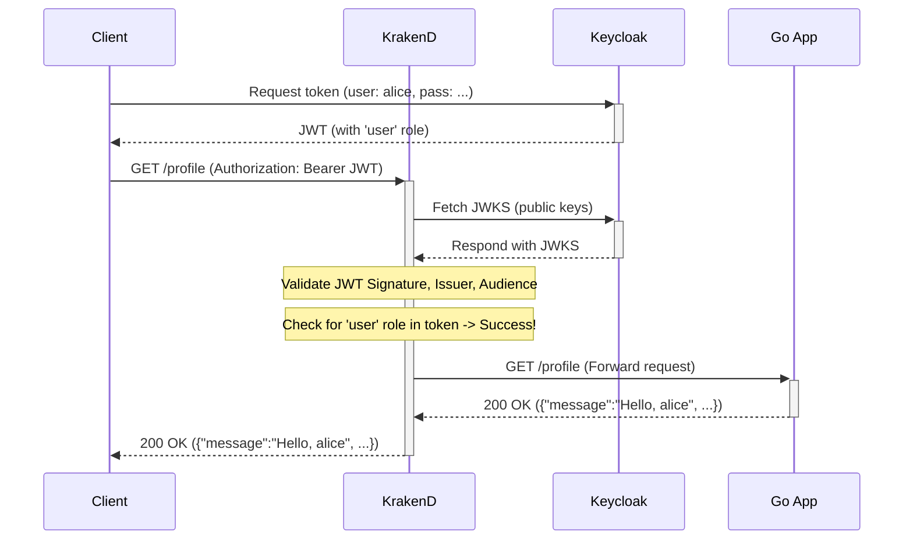
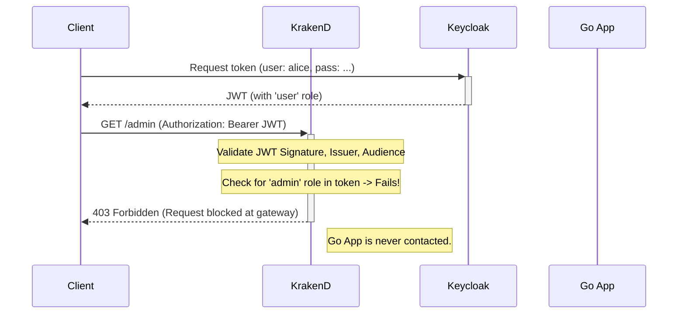

Of course. Adding Mermaid diagrams is an excellent way to visually explain the request flows. Here is the updated `README.md` with the requested sequential diagrams.

---

# Secure Go API with KrakenD and Keycloak

This project demonstrates a complete, production-ready setup for securing a Go backend API using KrakenD as an API Gateway and Keycloak for identity and access management.

It serves as a reference implementation that handles:
*   **Centralized Authentication:** All JWT validation is offloaded to the KrakenD gateway.
*   **Role-Based Access Control (RBAC):** Endpoints are protected based on user roles defined in Keycloak.
*   **Declarative Configuration:** All security policies are defined in KrakenD's configuration file.
*   **Robust Service Startup:** Docker Compose healthchecks are used to prevent common startup race conditions between services.

## Architecture

The request flow is as follows:

```
                      +-------------------+      +-----------------+
                      |                   |----->|  Keycloak       |
                      |   KrakenD Gateway |      | (JWKS Endpoint) |
+--------+            |   (Port :8081)    |      +-----------------+
|        |            |                   |
| Client +----------->|  - Auth/Authz     |      +-----------------+
|        |            |  - Rate Limiting  |----->|  Go Backend API |
+--------+            |  - Logging, etc.  |      |  (Port :3000)   |
                      |                   |      +-----------------+
                      +-------------------+
```

1.  A **Client** obtains a JWT from Keycloak.
2.  The Client makes a request to a protected endpoint on the **KrakenD Gateway**, including the JWT in the `Authorization` header.
3.  **KrakenD** intercepts the request.
    *   It fetches the public keys (JWKS) from Keycloak to validate the token's signature.
    *   It validates the token's issuer and audience.
    *   It inspects the token's claims to check if the user has the required roles for the endpoint.
4.  If validation succeeds, KrakenD forwards the request to the upstream **Go Backend API**.
5.  The **Go Backend API** trusts the request (as it came from the gateway) and processes it without re-validating the token.

## Request Flow Diagrams

### 1. Successful Request to a Protected Endpoint

This diagram shows the flow when a client with a valid token and correct roles accesses a protected endpoint like `/profile`.



### 2. Forbidden Request (Incorrect Role)

This diagram shows what happens when a client with a valid token but insufficient roles tries to access an admin-only endpoint.



## Project Structure

```
.
├── docker-compose.yml         # Main orchestrator for all services
├── Dockerfile                 # Dockerfile for the Go application
├── go.mod                     # Go module definitions
├── go.sum
├── krakend.json               # KrakenD gateway configuration
├── main.go                    # Go backend application source code
│
├── keycloak/
│   └── import-realm.json      # Keycloak realm, user, and client definitions
│
└── keycloak-custom/
    └── Dockerfile             # Dockerfile to build a custom Keycloak image with curl
```

## Prerequisites

*   [Docker](https://www.docker.com/get-started)
*   [Docker Compose](https://docs.docker.com/compose/install/)

## How to Run

1.  **Clone the repository:**
    ```bash
    git clone <your-repo-url>
    cd golang-krakend-keycloak
    ```

2.  **Clean up previous volumes (Important for a fresh start):**
    If you've run this before, this command ensures Keycloak re-imports the realm from your JSON file.
    ```bash
    docker-compose down -v
    ```

3.  **Build and start all services:**
    The `--build` flag is essential as it builds the custom images for your Go app and for Keycloak.
    ```bash
    docker-compose up --build -d
    ```
    Wait for 60-90 seconds for all services to start and pass their healthchecks. You can monitor the status with `docker-compose ps`.

## Testing the Endpoints

Use PowerShell or another terminal to run these commands.

**1. Get an Access Token for `alice` (role: user):**

```powershell
$resp = Invoke-RestMethod -Method Post `
  -Uri http://localhost:8080/realms/demo-realm/protocol/openid-connect/token `
  -ContentType "application/x-www-form-urlencoded" `
  -Body @{
    grant_type = 'password'
    client_id  = 'fiber-app'
    username   = 'alice'
    password   = 'password123'
  }
$token = $resp.access_token
```

**2. Test the Public Endpoint (no token needed):**
This should always succeed.

```powershell
curl http://localhost:8081/public
# Expected Output: {"message":"This is a public endpoint."}
```

**3. Test the Profile Endpoint (any authenticated user):**
This should succeed with Alice's token.

```powershell
curl -H "Authorization: Bearer $token" http://localhost:8081/profile
# Expected Output: {"issuedAt":...,"message":"Hello, alice","roles":["user"],...}
```

**4. Test the Admin Endpoint (requires 'admin' role):**
This will **fail** with Alice's token.

```powershell
curl -v -H "Authorization: Bearer $token" http://localhost:8081/admin
# Expected Output: HTTP/1.1 403 Forbidden
```

**5. Get a Token for `bob` (role: admin) and test again:**

```powershell
$resp_admin = Invoke-RestMethod -Method Post `
  -Uri http://localhost:8080/realms/demo-realm/protocol/openid-connect/token `
  -ContentType "application/x-www-form-urlencoded" `
  -Body @{
    grant_type = 'password'
    client_id  = 'fiber-app'
    username   = 'bob'
    password   = 'password123'
  }
$token_admin = $resp_admin.access_token

curl -v -H "Authorization: Bearer $token_admin" http://localhost:8081/admin
# Expected Output: HTTP/1.1 200 OK with JSON payload
```

---

## Deep Dive: The Configuration Explained

This setup required solving several common but tricky issues. Here is a breakdown of the critical configurations and why they are necessary.

### 1. Keycloak (`keycloak/import-realm.json`)

By default, Keycloak's JWTs are not immediately compatible with KrakenD. We must add two **Protocol Mappers** to the `fiber-app` client definition.

*   **Audience Mapper:**
    KrakenD requires the token to have an `aud` (audience) claim that matches what's in its config. Keycloak doesn't include this by default.
    ```json
    {
      "name": "Audience for fiber-app",
      "protocol": "openid-connect",
      "protocolMapper": "oidc-audience-mapper",
      "config": {
        "access.token.claim": "true",
        "included.client.audience": "fiber-app"
      }
    }
    ```
    **Problem Solved:** Prevents `401 Unauthorized` from KrakenD due to a missing/mismatched audience.

*   **Realm Roles Mapper:**
    KrakenD's role validation works best with a simple, top-level array of roles. Keycloak's default is a nested object (`"realm_access": {"roles": [...]}`). This mapper extracts the roles into a top-level `roles` claim.
    ```json
    {
      "name": "Realm Roles",
      "protocol": "openid-connect",
      "protocolMapper": "oidc-usermodel-realm-role-mapper",
      "config": {
        "access.token.claim": "true",
        "claim.name": "roles",
        "multivalued": "true"
      }
    }
    ```
    The key here is **`"multivalued": "true"`**, which ensures the output is a proper JSON array (`["user"]`) instead of a stringified array (`"[user]"`).
    **Problem Solved:** Prevents `403 Forbidden` from KrakenD due to it not finding the roles in the expected format.

### 2. KrakenD (`krakend.json`)

*   **JWT Validator (`krakend-jose/validator`):**
    This section configures KrakenD to validate incoming tokens.
    ```json
    "github.com/devopsfaith/krakend-jose/validator": {
      "alg": "RS256",
      "jwk_url": "http://keycloak:8080/realms/demo-realm/protocol/openid-connect/certs",
      "audience": ["fiber-app"],
      "issuer": "http://keycloak:8080/realms/demo-realm",
      "roles_key": "roles",
      "roles": ["user"]
    }
    ```
    Notice that `"roles_key": "roles"` points directly to the simple top-level claim we created in Keycloak.

*   **Backend Encoding (`"encoding": "no_op"`):**
    This is one of the most critical settings.
    ```json
    "backend": [
        {
            "host": ["http://app:3000"],
            "url_pattern": "/profile",
            "encoding": "no_op"
        }
    ]
    ```
    By default, KrakenD expects a `200` or `201` from the backend. If the backend returns any other status (like `403 Forbidden` if its own logic denies a request), KrakenD treats it as a failure and returns a generic `500 Internal Server Error` with the log `invalid status code`. Setting the encoding to `no_op` (no operation) tells KrakenD to simply pass through the backend's status code, headers, and body without interpretation.
    **Problem Solved:** Prevents KrakenD from masking backend errors with its own generic `500` error.

### 3. Go Application (`main.go`)

*   **Trusting the Gateway:**
    The most important architectural decision in the backend is to **remove its own JWT validation middleware**. Since KrakenD is a trusted part of our infrastructure and sits in front of the application, we can assume any request that reaches the `app` has already been authenticated and authorized.
    **Problem Solved:** Eliminates complex and brittle validation logic in the backend, which can fail due to subtle differences in configuration (e.g., `localhost` vs `keycloak` hostnames) and simplifies the application code.

*   **Parsing Claims without Validation:**
    The handlers still need user information from the token. We use a helper function to parse the token from the `Authorization` header without verifying its signature, as we trust KrakenD has already done this.
    ```go
    // Parse the token without verifying the signature. We trust KrakenD for that.
    token, _, err := new(jwt.Parser).ParseUnverified(tokenString, jwt.MapClaims{})
    ```

### 4. Docker (`docker-compose.yml` & Dockerfiles)

*   **Startup Race Condition:** A common problem in microservice environments is that one service (KrakenD) starts faster than its dependency (the `app` or `keycloak`) and fails when it tries to connect.
*   **The Healthcheck Solution:** We use `healthcheck` blocks in `docker-compose.yml` to define a command that Docker can run to see if a service is truly ready to accept traffic.
    ```yaml
    # In the app service
    healthcheck:
      test: ["CMD", "curl", "-f", "http://localhost:3000/public"]
    # ...
    # In the krakend service
    depends_on:
      app:
        condition: service_healthy
    ```
*   **Installing `curl`:** Minimal base images like `alpine` and the official Keycloak image do not include the `curl` utility. To make the healthchecks work, we must create custom Dockerfiles that install it.
    **Problem Solved:** Prevents the entire stack from failing on startup by ensuring a deterministic and robust startup order.