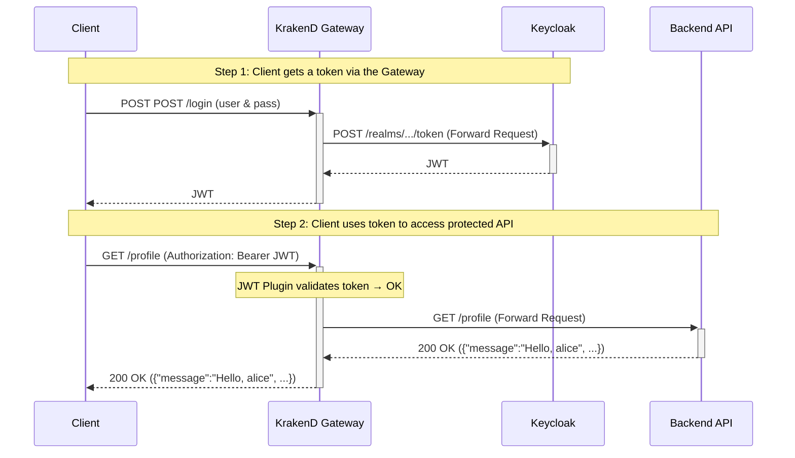

# Secure Go Backend API with KrakenD and Keycloak

This project demonstrates a complete, production-ready setup for securing a Backend API using **KrakenD** as an API Gateway and **Keycloak** for identity and access management.

This final version uses a best-practice approach where **all** traffic, including authentication requests, is proxied through the KrakenD gateway. KrakenD’s configuration is applied declaratively via its JSON config, and Docker Compose healthchecks ensure proper startup order.

## Architecture

In this secure architecture, the **only** entry point for external traffic is the KrakenD Gateway. The Backend API and Keycloak are isolated within the internal Docker network.

```
+--------+            +-------------------+      +-----------------+
| Client |----------->|                   |----->| Keycloak        |
|        |            |   KrakenD Gateway |<-----| (for /login &   |
|        |            |   (Port :8081)    |      |  JWKS)          |
|        |<---------- |                   |
+--------+            |  - JWT Validation |      +-----------------+
                      |  - Routing        |----->|  Backend API    |
                      |  - Proxy /login   |<-----|  (Port :3000)   |
                      |                   |      +-----------------+
                      +-------------------+
```

1. A **Client** requests a JWT from KrakenD’s `/login` endpoint.
2. **KrakenD** forwards this request to the internal **Keycloak** instance.
3. **Keycloak** returns a JWT to the client, proxied back through KrakenD.
4. The Client then makes a request to a protected API endpoint (e.g., `/profile`) on KrakenD, including the JWT.
5. **KrakenD** intercepts the request, fetches JWKS from Keycloak to validate the token’s signature, issuer, audience, and roles.
6. If valid, KrakenD forwards the request to the upstream **Backend API**.
7. The **Backend API** trusts the request (as it came from the gateway) and processes it.

## Request Flow Diagram


.
├── docker-compose.yml         # Orchestrates Mongo, Keycloak, Go app, KrakenD
├── Dockerfile                 # Go application Dockerfile
├── Dockerfile.keycloak        # Custom Keycloak (with curl) Dockerfile
├── go.mod                     # Go module definitions
├── go.sum
├── krakend.json               # KrakenD gateway configuration
├── main.go                    # Go backend application source code
├── test-all.ps1               # PowerShell automated test script
└── keycloak/
    └── import-realm.json      # Keycloak realm, users, and client definitions
```

## Prerequisites

* [Docker](https://www.docker.com/get-started)
* [Docker Compose](https://docs.docker.com/compose/install/)
* **Windows users:** PowerShell 7+, set execution policy:

  ```powershell
  Set-ExecutionPolicy -ExecutionPolicy RemoteSigned -Scope CurrentUser
  ```

## How to Run

1. **Clean up previous volumes** (so Keycloak re-imports):

   ```bash
   docker-compose down -v
   ```

2. **Build & start** all services:

   ```bash
   docker-compose up --build -d
   ```

3. **Wait for initialization** (\~60 seconds). Check with:

   ```bash
   docker-compose ps
   ```

4. **Verify** the gateway is up:

   ```bash
   curl http://localhost:8081/public
   # → {"message":"This is a public endpoint."}
   ```

## Available Users

| Username | Password      | Roles   |
| :------- | :------------ | :------ |
| `alice`  | `password123` | `user`  |
| `bob`    | `password123` | `admin` |

## Testing

### Manual Testing

1. **Obtain a Token** (via the gateway):

   ```powershell
   $resp = Invoke-RestMethod -Method Post `
     -Uri http://localhost:8081/login `
     -ContentType "application/x-www-form-urlencoded" `
     -Body @{ grant_type='password'; client_id='fiber-app'; username='alice'; password='password123' }
   $token = $resp.access_token
   ```

2. **Call Public**:

   ```bash
   curl http://localhost:8081/public
   ```

3. **Call Profile**:

   ```bash
   curl -H "Authorization: Bearer $token" http://localhost:8081/profile
   ```

4. **Call User**:

   ```bash
   curl -H "Authorization: Bearer $token" http://localhost:8081/user
   ```

5. **Call Admin**:

   ```bash
   curl -H "Authorization: Bearer $token" http://localhost:8081/admin
   ```

### Automated Script Testing

Run the included script:

```powershell
.\test-all.ps1
```

The script will:

1. Acquire tokens for `alice` and `bob` via `/login`.
2. Test `/public`, `/profile`, `/user`, and `/admin`.
3. Report pass/fail for each check.

> 💡 Integrate `test-all.ps1` into your CI pipeline (e.g., GitHub Actions on Windows runners) for end-to-end smoke tests.

---

## Deep Dive: The Configuration Explained

### 1. Keycloak (`import-realm.json`)

* **Audience Mapper** & **Realm Roles Mapper** → emit `aud` and top-level `roles` claims.

### 2. KrakenD (`krakend.json`)

* `/login` endpoint proxies token requests.
* `jwt/validator` plugin uses JWKS to validate tokens.
* `input_headers` + `proxy` plugin forward `Authorization`.

### 3. Go Application (`main.go`)

* JWT validation removed—trusted gateway.
* Uses `ParseUnverified` to extract claims.
* Enforces RBAC with `requireRole`.

### 4. Docker Healthchecks

* **app**: `curl -f /public`
* **krakend**: depends on `app` healthy.
